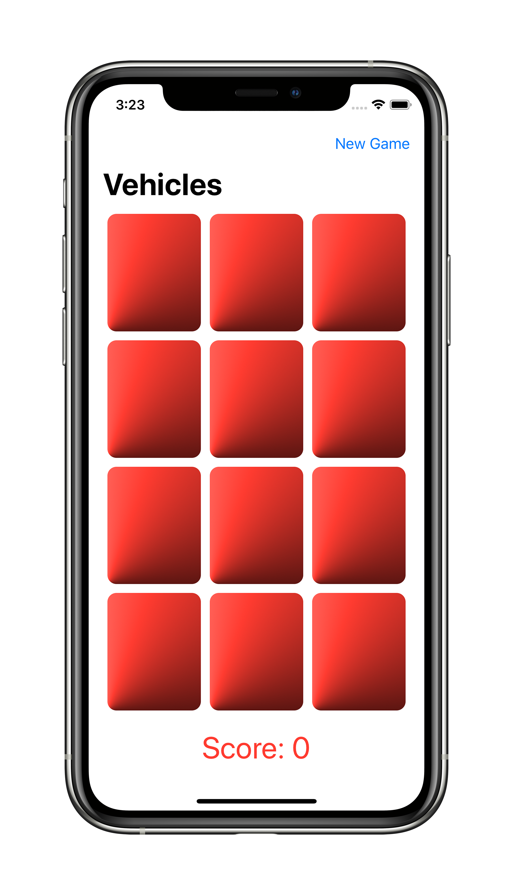

# CS193p SwiftUI 2020
Stanford University's CS193p Course (Spring 2020)

Course material can be found here: https://cs193p.sites.stanford.edu

I'm new to SwiftUI & programming in general so take my solutions with a grain of salt 🤷🏻‍♂️

 
